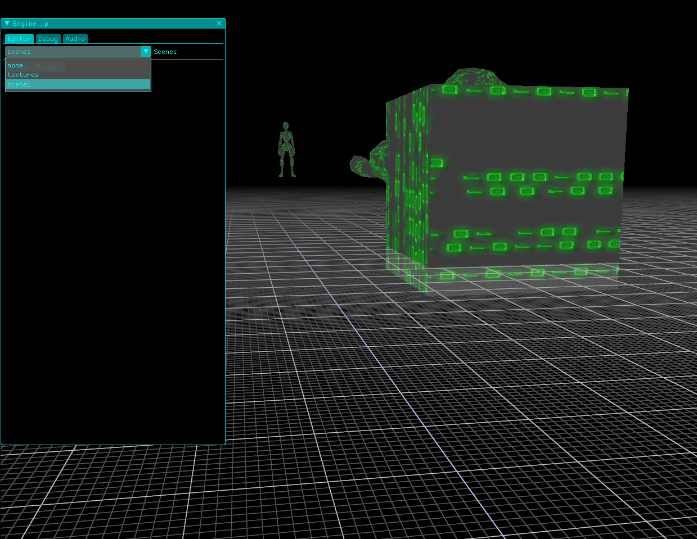

THE PROJECT IS IN DEVELOPMENT
MIGHT NOT WORK ON WINDOWS

# anthraxAI

The Vulkan-Based Game Engine

my youtube channel where I present my engine:
https://youtu.be/SPF7VJPwy3w?si=xls0e43Iry86vWob 

github repo:
https://gitlab.com/svatostop/engine-2-0

# how to test
launch via Visual Studio Code (not tested properly for windows)
optional for the linux systems:
 engine/assets/ $> ../build/demos/demo-models/anthraxAI-demo-models

# usage

1. in the game engine editor window press "3d" button
2. Select "Load Level"
3. In the text input field write "3" and press "Load"
4. Move the camera using WASD and mouse left button
5. In the editor window additionally select "Animation" checkbox to be able to change/debug animation
6. Additionally try to load "2" in the Level input field, to load 2d level

<div align="center">

</div>

[TOC]

## How to build

### Dependencies

To build this project, you need to have the following dependencies installed:

- [Vulkan SDK](https://vulkan.lunarg.com/sdk/home);
- X11/XCB libraries *(linux only)*;

If you're on linux, you can install them using the scripts under the `tools/linux` directory:

#### Install Vulkan SDK

```bash
./tools/linux/install-vulkan-sdk.sh
```

#### Install X11/XCB libraries

```bash
./tools/linux/install-x11-xcb.sh
```

If you're on windows, you can install the Vulkan SDK from the link above.

### Configure

This project uses CMake to generate the build files. To configure the project, you can use
the following commands:

```bash
cmake -B build -S .
```

During the configuration process, the shaders will be compiled using the `glslc` compiler.
If you don't want to compile them, you could pass the `-DAAI_COMPILE_SHADERS=OFF` flag to the
`cmake` command above.

### Build

After configuring the project, you can build it using the following command:

```bash
cmake --build build
```

## Build using Visual Studio Code

As you could notice, this project has the Visual Studio Code workspace file. If you want to build
and debug the project using Visual Studio Code, you can open the workspace file and install
the recommended extensions.

With the CMakeTools extension installed, you could select the compiler, and then build or run the
project using the <kbd>F7</kbd> and <kbd>F5</kbd> keys, respectively.

Don't forget that the <kbd>CTRL+SHIFT+P</kbd> key combination helps to `configure` and `build` as well.
